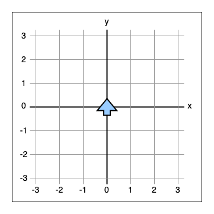
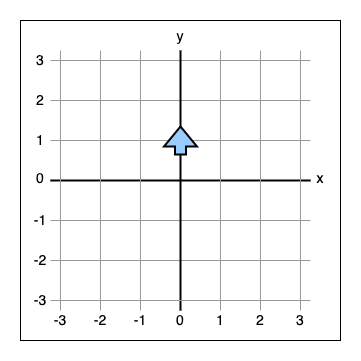
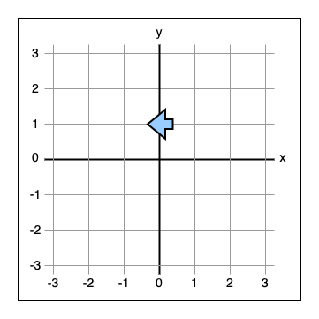
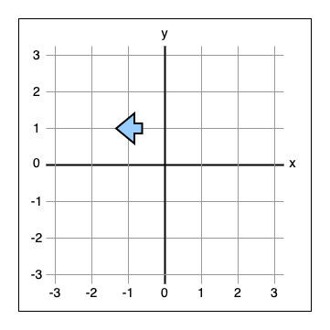
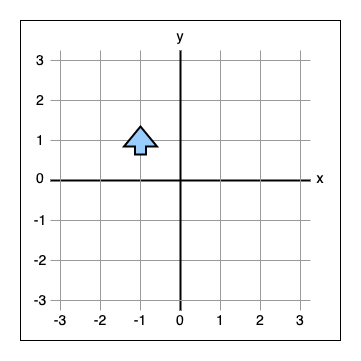
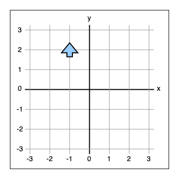
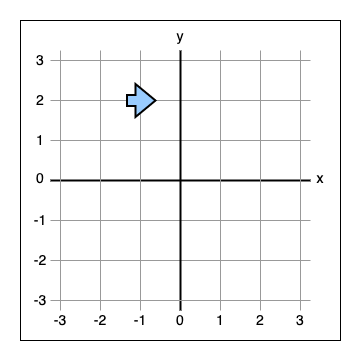
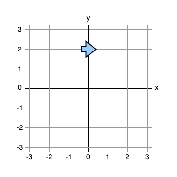
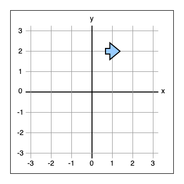
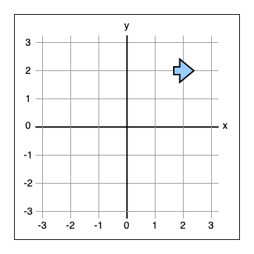

# Which? Engineering - Technical Exercise

## Scenario

We have a robot in an arena. The robot can move forward, turn left, or turn right. The robot turns on the spot. It moves one unit at a time.

We can tell the robot where it is in the arena using coordinates. And we can tell it the direction it is facing. As the robot moves it knows where it is in the arena & which direction it is facing.

We can give the robot a sequence of movements that it will follow along a path. For example, we could tell it to move forward, turn left, move forward. If the robot encounters a movement it does not understand it errors & goes no further.

The arena is square and of limited size. If the robot runs into the walls of the arena it crashes & goes no further.

## Problem

**For this part of the technical exercise we'd like you to implement the robot.** We do not expect this to take more than a couple of hours to do. If it takes any longer then you're probably over thinking it.

You are free to work however you feel most comfortable. You can commit small changes. You can write unit-tests.

We ask that you write your implementation in Typescript.

If you're successful we'll work together to extend the functionality of our robot at the next stage of the interview process.

## Constraints

The robot should read JSON input from stdin. The input will contain the following fields:

- `arena` will be two coordinates defining opposite corners of the arena
- `location` will be coordinates of the robot
- `heading` will be one of `north`, `south`, `east`, `west`
- `directions` will be an arbitrary length array containing movement commands: `forward`, `left`, `right`

Coordinates are always a structure with `x` and `y` fields. Both these fields contain integers.

We expect the robot to output JSON to stdout. The output will contain the following fields:

- `status` will be either `ok`, `error`, or `crash`
- `location` will be the final location coordinates of the robot having followed the `input` path
- `heading` will be the heading of the robot at the end of its path or the point of crashing
- `path` will be the path the robot took to its final point

In the case of an `error` or a `crash`, then the last movement in the `path` should be the one that caused the situation.

We expect valid JSON but do not require it to be neatly formatted.

## Running

This repository has been setup for you. You should only have to write the code.

You can run your robot using the following:

```sh
npm run robot < some-input-file.json
```

You can build a `robot.js` file using:

```sh
npm run build
```

We've setup eslint & prettier too. You can lint & format your code using:

```sh
npm run lint
```

And we've set Jest for tests:

```sh
npm run test
```

The tests do not cover everything we have asked for. They are there to get you started. You are welcome to add any more you see as necessary.

## Submitting

Before submitting your solution we strongly encourage you to run the tests (`npm run test`).

We’ll be running automated tests against your robot so please ensure the command line robot (`npm run robot < some-input-file.json`) outputs as described in the [constraints](#constraints).

If you're happy that your robot is passing all of [the examples](#examples) then you can send us your code as a ZIP file using:

```sh
npm run submit --candidate='candidate@example.com'
```

Please replace `candidate@example.com` with your email address so that we know whose submission it is!

This will create a ZIP file called `submission-candidate@example.com.zip` in the root of your repository. It will be packaged based on your currently active branch. It will only contain the necessary files.

This file will then be uploaded to our servers.

Once you have done this please send an email to our recruitment specialist (michael.kidd@which.co.uk). This just ensures that we know should anything go wrong with the upload.

**NOTE: We only accept your first submission**. So please, make sure you're completely happy with it.

## Examples

These examples can be found in the [examples](examples) directory of this repository. Each example header links to the associated entry in that directory. There are a few others in there too just to give you some test cases.

### [Walk through](examples/01-walk-through)

Given the following input:

```json
{
  "arena": {
    "corner1": { "x": -3, "y": -3 },
    "corner2": { "x": 3, "y": 3 }
  },

  "location": { "x": 0, "y": 0 },
  "heading": "north",

  "directions": ["forward", "left", "forward", "right", "forward", "right", "forward", "forward", "forward"]
}
```

We would expect the output to be:

```json
{
  "status": "ok",
  "location": { "x": 2, "y": 2 },
  "heading": "east",

  "path": ["forward", "left", "forward", "right", "forward", "right", "forward", "forward", "forward"]
}
```

<details>
  <summary>Click to reveal the steps</summary>
  
The arrow represents the robot.

**`"location": { "x": 0, "y": 0 }, "heading": "north"`**



`"directions": [`**`"forward"`**`,"left","forward","right","forward","right","forward","forward","forward"]`


`"directions": ["forward",`**`"left"`**`,"forward","right","forward","right","forward","forward","forward"]`


`"directions": ["forward","left",`**`"forward"`**`,"right","forward","right","forward","forward","forward"]`


`"directions": ["forward","left","forward",`**`"right"`**`,"forward","right","forward","forward","forward"]`


`"directions": ["forward","left","forward","right",`**`"forward"`**`,"right","forward","forward","forward"]`


`"directions": ["forward","left","forward","right","forward",`**`"right"`**`,"forward","forward","forward"]`


`"directions": ["forward","left","forward","right","forward","right",`**`"forward"`**`,"forward","forward"]`


`"directions": ["forward","left","forward","right","forward","right","forward",`**`"forward"`**`,"forward"]`


`"directions": ["forward","left","forward","right","forward","right","forward","forward",`**`"forward"`**`]`


</details>

### [Error](examples/02-error)

Given the following input:

```json
{
  "location": { "x": 0, "y": 0 },
  "heading": "north",

  "arena": {
    "corner1": { "x": -4, "y": -4 },
    "corner2": { "x": 4, "y": 4 }
  },

  "directions": ["forward", "jump"]
}
```

We would expect the output to be:

```json
{
  "status": "error",
  "location": { "x": 0, "y": 1 },
  "heading": "north",

  "path": ["forward", "jump"]
}
```

### [Crash](examples/03-crash)

Given the following input:

```json
{
  "location": { "x": 0, "y": 0 },
  "heading": "north",

  "arena": {
    "corner1": { "x": -4, "y": -4 },
    "corner2": { "x": 4, "y": 4 }
  },

  "directions": ["forward", "forward", "forward", "right", "forward", "left", "forward", "forward", "right"]
}
```

We would expect the output to be:

```json
{
  "status": "crash",
  "location": { "x": 1, "y": 4 },
  "heading": "north",

  "path": ["forward", "forward", "forward", "right", "forward", "left", "forward", "forward"]
}
```
